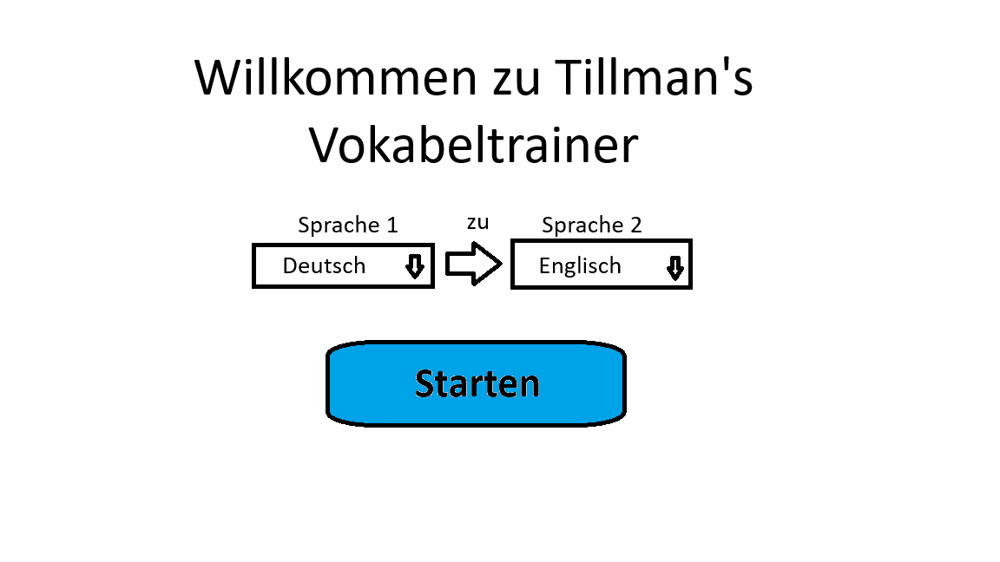
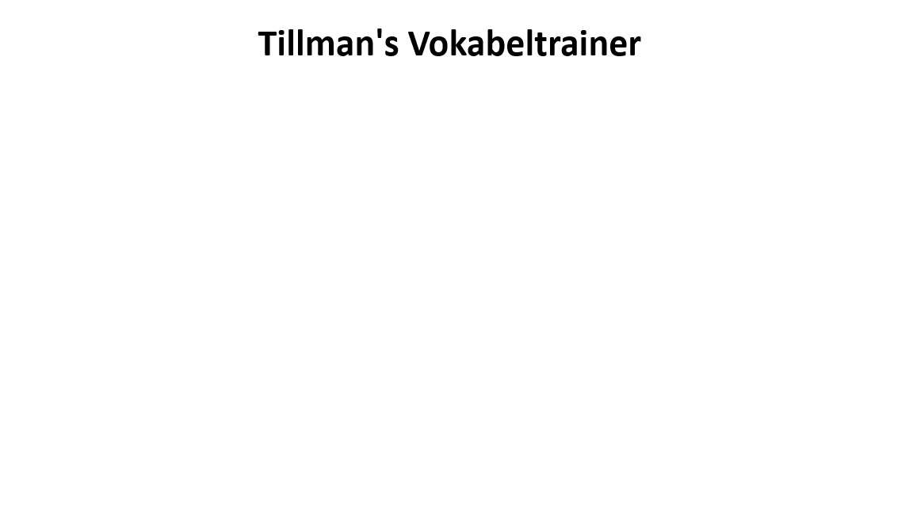
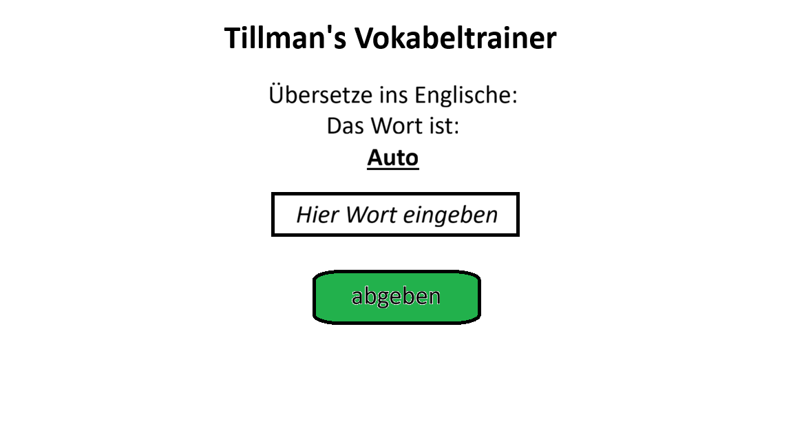
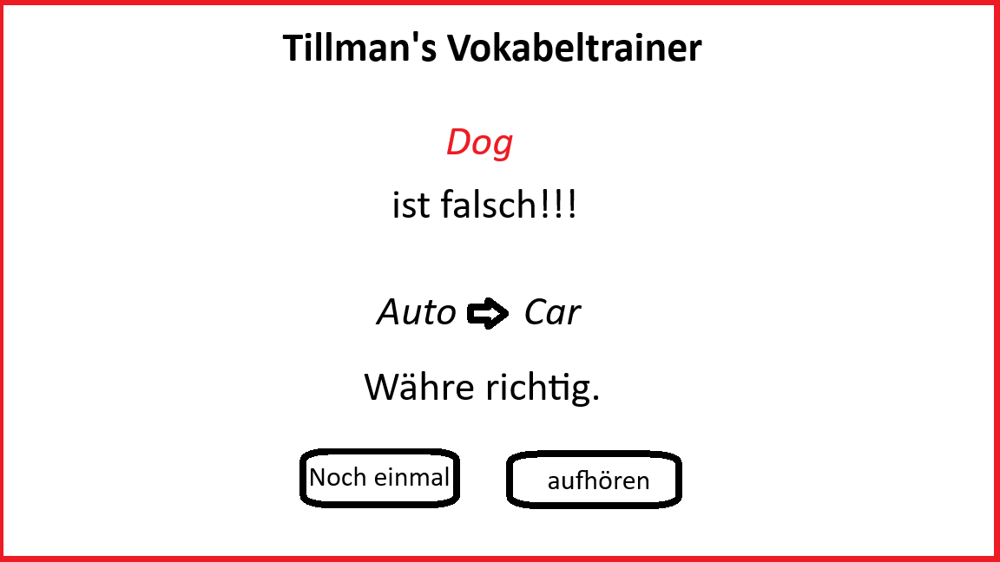

## Use Case Diagramm

## Use Case Tabelle
https://docs.google.com/spreadsheets/d/1D0gCK3bezqpNHFDjINKcEi1f9D8yA59uQ82AqhjG2IU/edit?usp=sharing

Glossa
## Identifiziere Objekte aus Use Case
Aktor: Student  
Use Case: Train Vocabulary  
Train Vocabulary includes:  
   - Get Word  
   - Check Anwser  
   - Get Answer  
   - Make Score  
Check Anwser extends from:  
  - Get Word  
  - Get Anwser  
Make Score extends from Check Anwser  

## Was ist ein Klassendiagram?
 - Ist ein UML Diagrammtyp.  
 - Zeigt wie ein System aufgebaut ist. Z.b. welche Klassen es gibt.
 - Wird genutzt um Software vorm programmieren zu planen.

## Klassensequezdiagram

## Weitere Use Cases:
beende Training  
Calculiere Score  
Print Score  

## Grenzklassen:
Startseite:

Abfrage:

Richtige Antwort abgegeben:

Falsche Antwort abgegeben:

## Klassentypen
.png)

## Factory Klassen
-Klassen erstellen  
-entitys mit den Factorys erstellen  
-singleton  