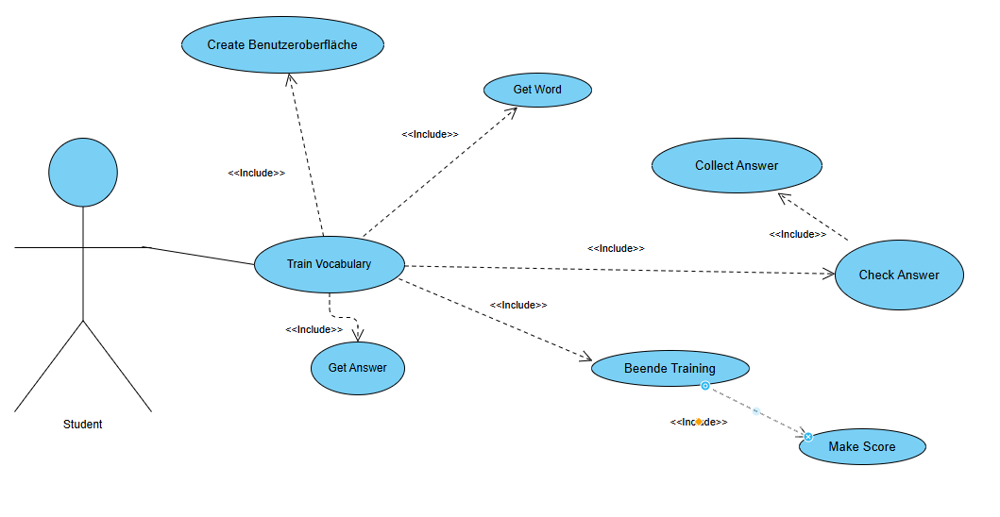

## Use Case Tabelle

## Identifiziere Objekte aus Use Case
Aktor: Student  
Use Case: Train Vocabulary  
Train Vocabulary includes:  
   - Get Word  
   - Check Anwser  
   - Get Answer  
   - Make Score  
Check Anwser extends from:  
  - Get Word  
  - Get Anwser  
Make Score extends from Check Anwser  

## Was ist ein Klassendiagram?
 - Ist ein UML Diagrammtyp.  
 - Zeigt wie ein System aufgebaut ist. Z.b. welche Klassen es gibt.
 - Wird genutzt um Software vorm programmieren zu planen.

## Klassensequezdiagram